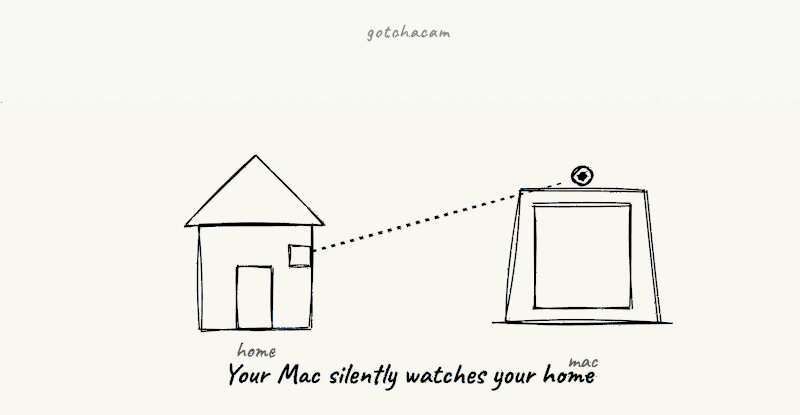

# gotchacam

> *Caméra de surveillance maison auto-hébergée — tes images restent chez toi, et un intrus se fait fracasser par ta propre voix en boucle.*

[](LICENSE)
[](#prerequisites)
[](#prerequisites)

<!-- Placeholder pour GIF démo -->
<!--  -->

---

## Pourquoi gotchacam est différent

🔒 **100% chez toi** — tes images ne transitent jamais par un cloud propriétaire. Tout vit sur ton Mac à la maison + Telegram (que tu as déjà).

🗣️ **Alarme dissuasive avec TA voix** — enregistre un message vocal directement depuis Telegram, applique un pitch shift "voix grave de cinéma" automatique, et déclenche-le en boucle au volume max d'un simple `/alarm` quand un intrus est dans ton appart.

💬 **Tout pilotable depuis Telegram** — pas d'app à installer pour le surveiller. Pause, reprise, snapshot à la demande, alarme, tout passe par tes messages habituels.

💸 **Gratuit et open source** — pas d'abonnement, pas de pub. Réutilise le vieux Mac qui dort dans ton placard.

---

## Comment ça marche

```
┌─────────────────┐  motion détecté   ┌──────────────┐
│   Webcam Mac    │ ────────────────► │   Telegram   │
│ (chez toi)      │   3 photos burst  │   (sur toi)  │
└────────┬────────┘                   └──────┬───────┘
         │                                   │
         │            commandes : /pause, /alarm, etc.
         │ ◄─────────────────────────────────┤
         │                                   │
         │            messages vocaux        │
         │ ◄─────────────────────────────────┤
         ▼                                   │
   joue ton message                          │
   en boucle à 100%                          │
   pour faire fuir                           │
```

## Commandes disponibles

| Commande | Effet |
|----------|-------|
| `/pause` | Met la détection en pause **et libère la caméra** (LED éteinte, conso réduite) |
| `/resume` | Reprend la détection |
| `/status` | Affiche l'état actuel (actif / en pause) |
| `/snapshot` | Envoie une photo immédiate |
| `/alarm` | Déclenche l'alarme dissuasive en boucle au volume max |
| `/stopalarm` | Arrête l'alarme et restaure le volume initial |
| `/recordalarm` | Enregistre un nouveau message vocal Telegram qui devient la nouvelle alarme (avec pitch shift auto) |
| `/sensitivity [valeur]` | Affiche ou modifie le seuil de détection à chaud (sans redémarrer) |
| `/history [N]` | Liste les N dernières détections (5 par défaut) |
| `/help` | Affiche la liste des commandes |

Tout **message vocal envoyé au bot** est diffusé une fois sur les haut-parleurs (mode intercom à distance). Pendant les 5 min suivant `/recordalarm`, il devient en plus la nouvelle alarme.

Pas de commande d'arrêt à distance volontairement — un clic accidentel laisserait la caméra hors service jusqu'à ton retour. Pour arrêter, `Ctrl+C` en local ou `launchctl unload` (cf. [AUTOSTART.md](AUTOSTART.md)).

## Prérequis

- macOS (testé Sequoia, Apple Silicon recommandé pour la conso énergétique)
- Python 3.8+
- Une webcam (interne ou USB)
- Un compte Telegram (gratuit)
- `ffmpeg` (pour la commande `/recordalarm`) — `brew install ffmpeg` ou `conda install -c conda-forge ffmpeg`

## Installation rapide

### 1. Cloner et installer

```bash
git clone https://github.com/<your-username>/gotchacam.git
cd gotchacam
python3 -m venv .venv
source .venv/bin/activate
pip install -r requirements.txt
```

### 2. Créer le bot Telegram

1. Sur Telegram, parler à **@BotFather** → `/newbot`
2. Récupérer le **token** (format `123456789:ABC...`)
3. Envoyer un message à ton bot fraîchement créé

### 3. Configurer

```bash
cp .env.example .env
# édite .env : colle ton token sur la ligne TELEGRAM_BOT_TOKEN=
```

Récupère ton chat_id :

```bash
python get_chat_id.py
```

Colle la valeur sur la ligne `TELEGRAM_CHAT_ID=` de `.env`.

### 4. Lancer

```bash
python cam.py
```

macOS demande l'autorisation caméra au premier lancement → accepte. Tu reçois `🎥 cam started` sur Telegram. Bouge devant la cam → tu reçois 3 photos en album.

## Démarrage automatique

Pour que ça tourne en permanence sans que tu aies à relancer manuellement :

```bash
bash install_autostart.sh
```

Voir [AUTOSTART.md](AUTOSTART.md) pour les détails (logs, arrêt, etc.).

## Configuration

Toutes les variables sont dans [.env.example](.env.example). Les plus utiles :

| Variable | Défaut | Rôle |
|----------|--------|------|
| `MIN_AREA` | `5000` | Seuil de détection (plus haut = ignore les petits mouvements) |
| `BURST_COUNT` | `3` | Nombre de photos par détection |
| `COOLDOWN_SECONDS` | `3` | Délai mini entre deux alertes |
| `ALARM_PITCH` | `1.0` | Pitch des enregistrements vocaux (0.75 = -25% pour effet "voix grave") |
| `SITE_NAME` | *(vide)* | Préfixe les messages, utile si tu as plusieurs caméras |
| `RETENTION_DAYS` | `30` | Durée de conservation des captures |

Voir [shared/BEHAVIOR_SPEC.md](shared/BEHAVIOR_SPEC.md) pour la spec comportementale complète.

## Roadmap

- [ ] Portage Android natif (réutiliser un vieux téléphone comme caméra autonome)
- [ ] Portage Windows / Linux (version cross-platform)
- [ ] Wizard d'installation graphique (pour utilisateurs non-développeurs)
- [ ] Détection humain vs ombre/animal (ML Kit / TFLite)
- [ ] Multi-caméras

## Architecture

Le projet est conçu pour partager le maximum entre l'implémentation macOS Python et le futur portage Android :

- [shared/defaults.json](shared/defaults.json) — constantes communes
- [shared/strings.fr.json](shared/strings.fr.json) — messages Telegram
- [shared/BEHAVIOR_SPEC.md](shared/BEHAVIOR_SPEC.md) — spec comportementale formelle

Voir [MULTIPLATFORM.md](MULTIPLATFORM.md) pour le pattern et la discipline.

## Documentation

- [README.md](README.md) — ce fichier
- [AUTOSTART.md](AUTOSTART.md) — démarrage automatique macOS
- [MULTIPLATFORM.md](MULTIPLATFORM.md) — architecture multi-plateforme
- [shared/BEHAVIOR_SPEC.md](shared/BEHAVIOR_SPEC.md) — spec comportementale formelle

## Remerciements et contexte

Construit pour mon usage personnel (surveiller mon appart depuis le boulot), publié au cas où ça en intéresse d'autres. Pas de prétention à concurrencer Frigate, Alfred ou Wyze — `gotchacam` cible un cas d'usage précis : technicien possesseur de Mac qui veut quelque chose de simple, privacy-respecting et avec un effet "scare them" personnalisé.

## License

[MIT](LICENSE) — utilise comme tu veux, modifie comme tu veux. Si tu en fais quelque chose de cool, ping-moi via une issue.

---

⚠️ **Avertissement légal** : tu ne peux filmer que ta propre propriété. Filmer la rue, un voisin, ou un espace public sans consentement explicite est interdit en France (article 226-1 du Code pénal). À toi de bien orienter la caméra.
